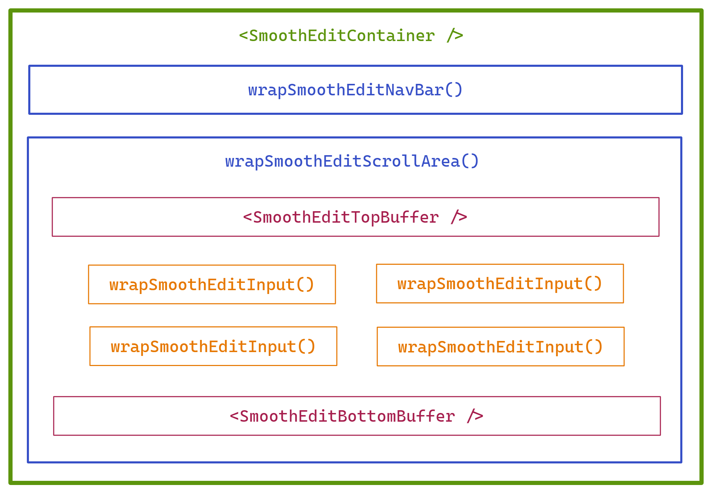

# smooth-edit


`smooth-edit` is a smooth edit mode framework for React. It allows you to implement a seamless transition between a view and an edit mode to provide the user with an optimal editing experience. It is UI and form library agnostic.

## Installation

Use your favourite manager to install the [package](https://www.npmjs.com/package/smooth-edit):

```sh
yarn add smooth-edit
```

```sh
npm install smooth-edit --save
```

## Overview



**`<SmoothEditContainer />`:** Renders an initialized `SmoothEditContext`.

**`useContext(SmoothEditContext)`:** Provides access to the edit mode and other tools wherever needed.

**`wrapSmoothEditNavBar()`:** Wraps your _navigation bar_ in a higher-order component. It injects the edit mode and other tools into the inner component. It also enables the framework to track any visual transitions.

**`wrapSmoothEditScrollArea()`:** Wraps your _scroll area_ in a higher-order component. It injects the **`SmoothEditTopBuffer`** and **`SmoothEditBottomBuffer`** buffer components that must be rendered within the scroll area and other tools into the inner component. It also enables the framework to track any visual transitions.

**`wrapSmoothEditInput()`:** Wraps your _input components_ in higher-order components. It injects the edit mode and other tools into the inner component. It also enables the framework to fixate the viewport position of the input component during the transition that triggered the edit mode. And it enables the framework to track any visual transitions.

## Examples

-   [Custom](examples/custom): Uses custom form components with tailor-made CSS transitions.
-   [MUI](examples/mui): Uses MUI components that are combined via [SmoothTransition](https://www.npmjs.com/package/smooth-transition). See [mui.com](https://mui.com/) to learn more about MUI.

## Reference

### &lt;SmoothEditContainer /&gt;

A non-visual React component with the following properties:

-   `children: ReactNode`: Children to be rendered.

### useContext(SmoothEditContext)

A context providing the following properties:

-   `editMode: boolean`: Indicates if edit mode is active.
-   `editTrigger: string | null`: Provides the ID of the input component that activated the edit mode if applicable. The individual input components translate the `editTrigger` flag into a boolean. See `wrapSmoothEditInput()` for more.
-   `activateEditMode: (id?: string) => void`: Activates the edit mode. Pass the `id` of the input component that triggered the edit mode if applicable. The individual input components provide pass the `id` parameter automatically. See `wrapSmoothEditInput()` for more.
-   `deactivateEditMode: () => void`: Deactivates the edit mode.

### wrapSmoothEditNavBar()

A higher-order component that passes through all properties and injects the following additional properties into the inner component:

-   `rootRef: RefCallback<HTMLElement>`: Reference expected to be attached to the root DOM element of the component. The framework uses it to track the visual transitions of the component.
-   `editMode: boolean`: Indicates if edit mode is active.
-   `activateEditMode: () => void`: Activates the edit mode.
-   `deactivateEditMode: () => void`: Deactivates the edit mode.

### wrapSmoothEditScrollArea()

A higher-order component that passes through all properties and injects the following additional properties into the inner component:

-   `rootRef: RefCallback<HTMLElement>`: Reference expected to be attached to the root DOM element of the component. The framework uses it to track the visual transitions of the component.
-   `editMode: boolean`: Indicates if edit mode is active.
-   `activateEditMode: () => void`: Activates the edit mode.
-   `deactivateEditMode: () => void`: Deactivates the edit mode.
-   `SmoothEditTopBuffer: ComponentType`: A buffer component that must be rendered at the _top_ of the scroll area. The framework uses it to generate buffer space within the scroll area if needed to fixate the viewport position of an input element during the edit mode transition.
-   `SmoothEditBottomBuffer: ComponentType`: A buffer component that must be rendered at the _bottom_ of the scroll area. See above.

### wrapSmoothEditInput()

A higher-order component that passes through all properties and injects the following additional properties into the inner component:

-   `rootRef: RefCallback<HTMLElement>`: Reference expected to be attached to the root DOM element of the component. The framework uses it to track the visual transitions of the component.
-   `contentRef: RefCallback<HTMLElement>`: Reference expected to be attached to the content-carrying DOM element of the component. The framework uses it to fixate the viewport position of an input element during the edit mode transition. Use [`useRefWithForwarding()`](https://www.npmjs.com/package/use-ref-with-forwarding) to combine `rootRef` and `contentRef` if they are the same.
-   `editMode: boolean`: Indicates if edit mode is active.
-   `editTrigger: boolean`: Indicates if the input component triggered the edit mode. It can be used to set the initial focus on an inner input component if the inner component is switched during the transition ([example](examples/mui/src/Content/ContentBody.tsx)).
-   `activateEditMode: () => void`: Activates the edit mode.
-   `deactivateEditMode: () => void`: Deactivates the edit mode.

## License

This library is licensed under the MIT license.

## Contributing

We welcome contributions to the `smooth-edit` library. To contribute, simply open a [pull request](https://github.com/teamrevin/smooth-edit/pulls) with your changes.
